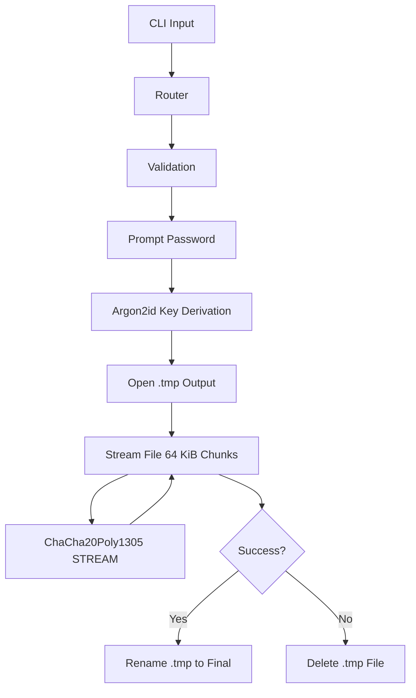

# CFX Architecture

CFX is structurally composed of distinct operational layers that process data from the command line down to the binary file output.

## Core Layers

1. **CLI Layer (`src/main.rs`)**: Leverages `clap` to parse arguments, validate flags, and route commands to specific operation modules.
2. **Error Layer (`src/error.rs`)**: A centralized `CfxError` enum powered by `thiserror`, strictly typed to handle I/O, Cryptography, Formatting, and CLI failures.
3. **Cryptography Layer (`src/crypto.rs`)**: Encapsulates external crates (`argon2`, `chacha20poly1305`, `rand`). Exposes clean interfaces for deriving keys and generating `STREAM` encryptors/decryptors. Handles safe fallback behavior for securely acquiring passwords from `stdin` or interactive TTYs.
4. **File Format Layer (`src/format.rs`)**: Defines the `CfxHeader` struct. Manages the reading and writing of CFX Magic Bytes, versions, algorithm mappings, salts, and nonces. 
5. **Operation Layer (`src/ops/`)**: Contains the core logic separated by command. 

## Data Flow

CFX ensures a safe sequence of events for every destructive operation:

1. **CLI Routing**: Arguments are routed to `src/ops/<command>.rs`.
2. **Validation**: Source files are checked for existence, type (regular file), and maximum size limit (10 GiB).
3. **Password Handling**: The `crypto` module prompts the user for passwords via TTY (or strictly reads `stdin` if piped).
4. **Key Derivation**: Passwords and salts are passed to Argon2id to generate the 32-byte cryptographic key.
5. **Temporary Output**: An output file is opened with a `.tmp` extension.
6. **File Processing (Streaming)**: The file is read in 64 KiB chunks. 
   - A single metadata chunk (filename, file size) is generated, encrypted, and written first.
   - The file payload is subsequently encrypted chunk-by-chunk and streamed to the `.tmp` file.
7. **Progress Reporting**: `indicatif` provides progress bars dynamically mapped to the source file length.
8. **Finalization**: If and only if all chunks are successfully authenticated/encrypted, the `.tmp` file is renamed to the final requested output path, and the original file is optionally removed. If an error occurs midway, the `.tmp` file is aggressively deleted.

## Flow Diagram

